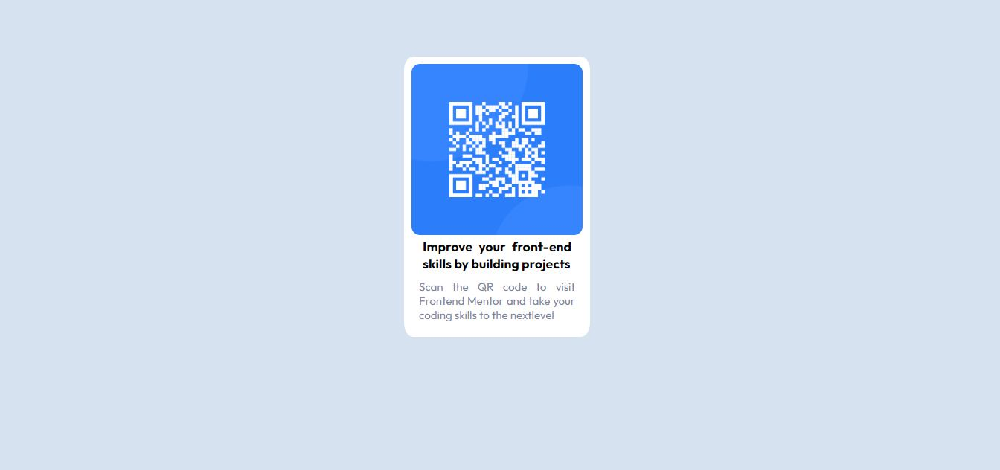

# Frontend Mentor - QR code component solution

This is a solution to the [QR code component challenge on Frontend Mentor](https://www.frontendmentor.io/challenges/qr-code-component-iux_sIO_H). Frontend Mentor challenges help you improve your coding skills by building realistic projects. 

## Table of contents

- [Overview](#
By doing this project I was able to put CSS selectors into practice such as displey: flex; to manage containers and align like sample photo, then apply layouts.)
  - [Screenshot](#./images/desafio1frontend.JPG)
  - [Links](#links)
- [My process](#I followed the instructions to the last detail, in the body I added a div with the container-qr class, and within it the img, h3 and p tags.)
  - [Built with](#HTML, CSS, DISPLAY FLEX and box-sizing: border-box.)
  - [What I learned](#I learned more about positioning in CSS.)
  - [Continued development](#continued-development)
  - [Useful resources](#prior knowledge of CSS selectors)
- [Author](#Rodolfo Rodriguez (rodcode))
- [Acknowledgments](#thanks to frontendmentor for being part of my evolution as a developer)

## Overview

### Screenshot



### Links

- Solution URL: [Add solution URL here](https://your-solution-url.com)
- Live Site URL: [Add live site URL here](https://your-live-site-url.com)

## My process

### Built with

- Semantic HTML5 markup
- CSS custom properties
- Flexbox

### What I learned


```html
<h1>Some HTML code I'm proud of</h1>
<h2>These are the tags I used for this project</h2>
  <div>
  
  <h3>
  <p>

```
```css
.container-qr {
    width: 90%;
    max-width: 250px;
}

### Continued development

The next step in my training is to reinforce and practice flexbox, I think it is essential to become a good front.

### Useful resources

- [Midudev](https://youtu.be/PSwlAuRbv_A?si=GxLPhuSkO25C3i89) - This is an excellent MIDUDEV video tutorial, I highly recommend it if you want to learn CSS.

### I want to thank the frontendmentor community for these challenges that help us develop our skills, midudev for his tutorials and Marcel Pernia for his mentoring...


